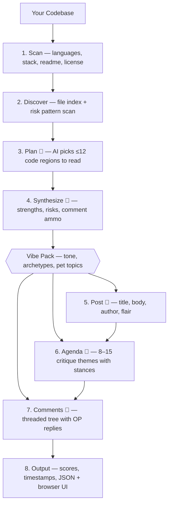

# Reddit Scrutinizer

[](https://bun.sh)
[](https://www.typescriptlang.org/)
[](https://docs.anthropic.com)

Simulate Reddit reactions to your codebase before you post.
Uses Claude to generate realistic community feedback in the voice of any subreddit.

<p align="center">
  
  <br>
  <em>Yes, we ran it on itself. Yes, it roasted us.</em>
</p>

## How it works

1. **Scan** — walks your project, detects languages/stack, reads key files into a project dossier
2. **Discover** — builds a file index, scans for risk patterns (eval, innerHTML, TODO/FIXME, etc.)
3. **Plan** — 🤖 AI picks the most interesting code regions to read based on the dossier and risk signals
4. **Synthesize** — 🤖 AI reads those code snippets and produces an evidence pack (strengths, risks, comment ammo)
5. **Post** — 🤖 AI generates a realistic Reddit submission as if you posted your project
6. **Agenda** — 🤖 AI analyzes critique themes the community would focus on, grounded in the evidence
7. **Comments** — 🤖 AI generates a threaded comment tree with scores, flairs, and OP replies
8. **Output** — assigns scores/timestamps, writes structured JSON, and optionally starts the browser UI



## Prerequisites

- An [Anthropic API key](https://console.anthropic.com/)

## Install

```bash
# Install globally (bun runtime is bundled automatically)
npm install -g reddit-scrutinizer

# Or run directly without installing
npx reddit-scrutinizer ./my-project --subreddit rust

# If you have bun installed, you can also use:
bun add -g reddit-scrutinizer
bunx reddit-scrutinizer ./my-project --subreddit rust
```

## Usage

```bash
# Set your API key
export ANTHROPIC_API_KEY=sk-ant-...

# Scan a project, write JSON, and exit
reddit-scrutinizer ./my-project --subreddit rust

# Snarky r/programming with 60 comments, auto-open browser
reddit-scrutinizer ./my-project --subreddit programming --comments 60 --style snarky --open

# Reproducible run with a fixed seed
reddit-scrutinizer ./my-project --subreddit typescript --seed 42

# See selected reads, risk signals, AI timings, and comment batch progress
reddit-scrutinizer ./my-project --subreddit selfhosted --comments 70 --verbose

# Use a different theme
reddit-scrutinizer ./my-project --subreddit programming --theme hackernews --open
reddit-scrutinizer ./my-project --subreddit programming --theme producthunt --open
reddit-scrutinizer ./my-project --subreddit programming --theme twitter --open
reddit-scrutinizer ./my-project --subreddit programming --theme bluesky --open
reddit-scrutinizer ./my-project --subreddit programming --theme qdb --open

# View a previous result
reddit-scrutinizer serve ./reddit-scrutiny.json --open

# View with a different theme
reddit-scrutinizer serve ./reddit-scrutiny.json --theme hackernews --open
```

## Options

| Flag                 | Default                      | Description                                                                  |
| -------------------- | ---------------------------- | ---------------------------------------------------------------------------- |
| `--api-key <key>`    | —                            | Anthropic API key (overrides `ANTHROPIC_API_KEY` env var)                    |
| `--subreddit <name>` | `programming`                | Target subreddit voice                                                       |
| `--comments <n>`     | `40`                         | Number of comments to generate                                               |
| `--max-depth <n>`    | `4`                          | Max reply nesting depth                                                      |
| `--max-replies <n>`  | `3`                          | Number of OP replies                                                         |
| `--style <mode>`     | `balanced`                   | `balanced`, `snarky`, `supportive`, `hostile`                                |
| `--theme <name>`     | `reddit`                     | UI theme: `reddit`, `hackernews`, `producthunt`, `twitter`, `bluesky`, `qdb` |
| `--model <name>`     | `claude-sonnet-4-5-20250929` | Anthropic model                                                              |
| `--out <file>`       | `./reddit-scrutiny.json`     | Output file path                                                             |
| `--open`             | `false`                      | Start the UI server and open it in the browser                               |
| `--port <n>`         | `3000`                       | Preferred UI server port when using `--open`                                 |
| `--temperature <n>`  | `0.8`                        | Sampling temperature from 0 to 1; ignored by unsupported models              |
| `--seed <n>`         | —                            | Random seed for reproducibility                                              |
| `--max-tokens <n>`   | automatic                    | Override output tokens per AI call; comment batches auto-scale up to 64000   |
| `--batch-size <n>`   | `50`                         | Comments per batch. Large comment counts are split into batches              |
| `--verbose`          | `false`                      | Show timings, scan details, selected reads, and comment batch progress       |

Newer Anthropic models may reject sampling parameters such as `temperature`. The Anthropic provider in the Vercel AI SDK detects those models, ignores the unsupported setting, and reports a warning instead of failing the run.

## Progress output

Normal runs show the eight pipeline stages and final output locations. Add `--verbose` to see:

- Effective model, subreddit, style, theme, seed, and batch settings
- File, language, stack, test, CI, license, and risk-signal summaries
- Code regions selected for AI-assisted discovery
- Timings for every stage and progress for each comment batch
- Output size, resolved path, and browser server port

Verbose output never prints API keys, prompts, source snippets, or raw model responses.

## Available subreddits

Each subreddit has its own vibe pack defining tone, pet topics, taboos, commenter archetypes, and typical replies.

Unknown subreddit names use the generic fallback pack.

`cpp` · `csharp` · `devops` · `experienceddevs` · `gamedev` · `golang` · `haskell` · `java` · `javascript` · `kotlin` · `linux` · `lisp` · `localllama` · `machinelearning` · `php` · `programming` · `python` · `reactjs` · `rust` · `selfhosted` · `typescript` · `webdev`

## Serve command

View results from a previous run without re-generating:

```bash
reddit-scrutinizer serve ./reddit-scrutiny.json --port 3000 --open
reddit-scrutinizer serve ./reddit-scrutiny.json --theme producthunt --open
reddit-scrutinizer serve ./reddit-scrutiny.json --theme twitter --open
reddit-scrutinizer serve ./reddit-scrutiny.json --theme qdb --open
```

The `serve` command accepts `--port`, `--open`, `--theme`, and `--verbose`.

## Shell completions

Generate completions from the current command tree and load them in your shell. Add the relevant command to your shell configuration to keep completions enabled across sessions.

### Bash

```bash
eval "$(reddit-scrutinizer completions bash)"
```

### Zsh

Initialize Zsh completions before loading the generated script:

```zsh
autoload -Uz compinit && compinit
eval "$(reddit-scrutinizer completions zsh)"
```

### Fish

```fish
reddit-scrutinizer completions fish | source
```

### PowerShell

```powershell
reddit-scrutinizer completions powershell | Out-String | Invoke-Expression
```

## Development

```bash
bun install
bun run dev             # Run the CLI from source
bun test                # Run isolated tests
bun run test:coverage   # Run tests with a coverage report
bun run format          # Format the repository with Oxfmt
bun run lint            # Run Oxlint with warnings treated as failures
bun run typecheck       # Typecheck source and tests
bun run check           # Run every CI check
```
