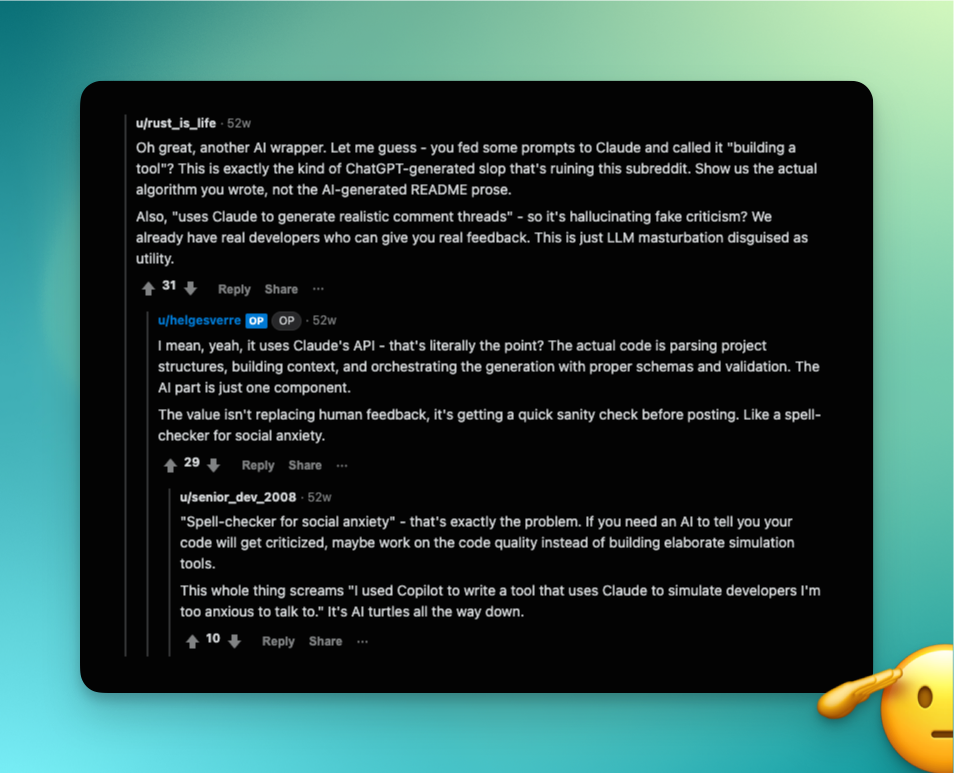
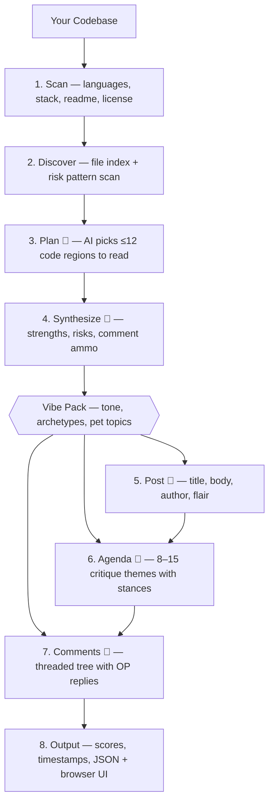

# Reddit Scrutinizer

[](https://bun.sh)
[](https://www.typescriptlang.org/)
[](https://docs.anthropic.com)

Simulate Reddit reactions to your codebase before you post.
Uses Claude to generate realistic community feedback in the voice of any subreddit.

<p align="center">
  
  <br>
  <em>Yes, we ran it on itself. Yes, it roasted us.</em>
</p>

## How it works

1. **Scan** — walks your project, detects languages/stack, reads key files into a project dossier
2. **Discover** — builds a file index, scans for risk patterns (eval, innerHTML, TODO/FIXME, etc.)
3. **Plan** — 🤖 AI picks the most interesting code regions to read based on the dossier and risk signals
4. **Synthesize** — 🤖 AI reads those code snippets and produces an evidence pack (strengths, risks, comment ammo)
5. **Post** — 🤖 AI generates a realistic Reddit submission as if you posted your project
6. **Agenda** — 🤖 AI analyzes critique themes the community would focus on, grounded in the evidence
7. **Comments** — 🤖 AI generates a threaded comment tree with votes, flairs, awards, and OP replies
8. **Output** — assigns scores/timestamps, writes structured JSON, and optionally opens a browser UI



## Prerequisites

- An [Anthropic API key](https://console.anthropic.com/)

## Install

```bash
# Install globally (bun runtime is bundled automatically)
npm install -g reddit-scrutinizer

# Or run directly without installing
npx reddit-scrutinizer ./my-project --subreddit rust

# If you have bun installed, you can also use:
bun add -g reddit-scrutinizer
bunx reddit-scrutinizer ./my-project --subreddit rust
```

## Usage

```bash
# Set your API key
export ANTHROPIC_API_KEY=sk-ant-...

# Scan a project and simulate r/rust feedback
reddit-scrutinizer ./my-project --subreddit rust

# Snarky r/programming with 60 comments, auto-open browser
reddit-scrutinizer ./my-project --subreddit programming --comments 60 --style snarky --open

# Reproducible run with a fixed seed
reddit-scrutinizer ./my-project --subreddit typescript --seed 42

# Use the Hacker News or Product Hunt theme
reddit-scrutinizer ./my-project --subreddit programming --theme hackernews --open
reddit-scrutinizer ./my-project --subreddit programming --theme producthunt --open

# View a previous result
reddit-scrutinizer serve ./reddit-scrutiny.json --open

# View with a different theme
reddit-scrutinizer serve ./reddit-scrutiny.json --theme hackernews --open
```

## Options

| Flag                 | Default                    | Description                                     |
| -------------------- | -------------------------- | ----------------------------------------------- |
| `--subreddit <name>` | `programming`              | Target subreddit voice                          |
| `--comments <n>`     | `40`                       | Number of comments to generate                  |
| `--max-depth <n>`    | `4`                        | Max reply nesting depth                         |
| `--max-replies <n>`  | `3`                        | Number of OP replies                            |
| `--style <mode>`     | `balanced`                 | `balanced`, `snarky`, `supportive`, `hostile`   |
| `--theme <name>`     | `reddit`                   | UI theme: `reddit`, `hackernews`, `producthunt` |
| `--model <name>`     | `claude-sonnet-4-20250514` | Anthropic model                                 |
| `--out <file>`       | `./reddit-scrutiny.json`   | Output file path                                |
| `--open`             | `false`                    | Auto-open browser                               |
| `--port <n>`         | `3000`                     | UI server port                                  |
| `--no-ui`            | —                          | Skip web UI                                     |
| `--temperature <n>`  | `0.8`                      | Generation temperature                          |
| `--seed <n>`         | —                          | Random seed for reproducibility                 |

## Available subreddits

Each subreddit has its own vibe pack defining tone, pet topics, taboos, commenter archetypes, and typical replies.

`cpp` · `csharp` · `devops` · `experienceddevs` · `gamedev` · `golang` · `haskell` · `java` · `javascript` · `kotlin` · `linux` · `lisp` · `localllama` · `machinelearning` · `php` · `programming` · `python` · `reactjs` · `rust` · `selfhosted` · `typescript` · `webdev`

## Serve command

View results from a previous run without re-generating:

```bash
reddit-scrutinizer serve ./reddit-scrutiny.json --port 3000 --open
reddit-scrutinizer serve ./reddit-scrutiny.json --theme producthunt --open
```

The `serve` command accepts `--port`, `--open`, and `--theme`.
